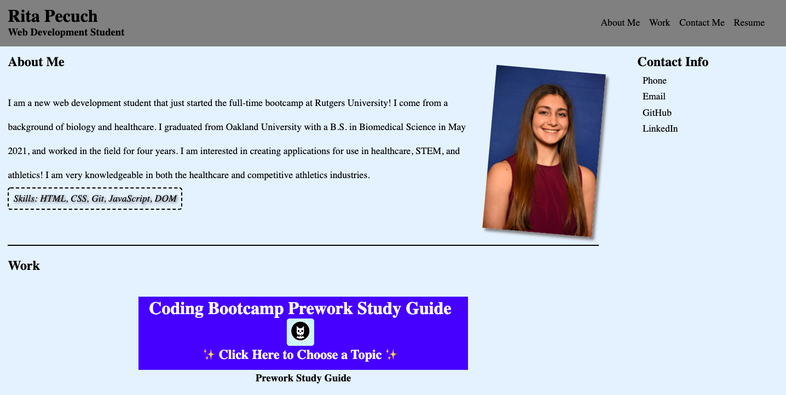
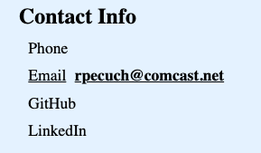
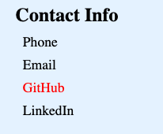
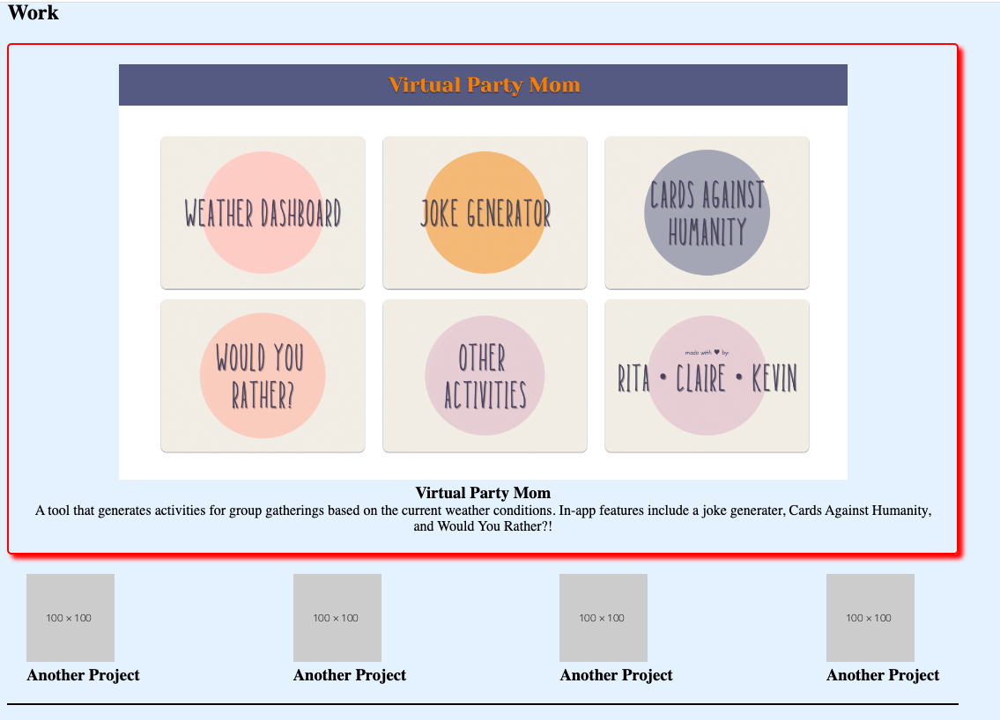

# Professional Portfolio

## Description

The purpose of this project was to build a professional portfolio that I can use in the future to showcase to potential employers. This will allow hiring managers to view all of my information, work samples, and contact information in one place. While building this project, I gained experience implementing various CSS selectors, properties, pseudo-classes, and pseudo-elements. I became much more comfortable using the flexbox layout and creating a web design that adapts to various screen sizes. This portfolio will continue to be updated as I learn new skills and deploy more applications.

## Usage

To access this webpage, visit the following URL: [https://rpecuch.github.io/portfolio/](https://rpecuch.github.io/portfolio/). Users may navigate to specific sections using the links in the header of the page.

To display my phone number or email, simply hover over the word "Phone" or "Email".

To be redirected to my GitHub account or LinkedIn account, simply click on the link.

To view samples of my work, simply click on the images in the "Work" section.

## License

Please refere to the license in the repo.